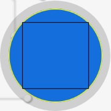

# Enclave Branding — default logo + background

The Tide login enclave displays your realm's **logo** and **background image**. This template gets you
a correct default in one command, and validates any asset before you spend an upload on it.

## One command brands the realm

```bash
./brand-tidecloak.sh --realm myapp --accent 1f6feb --name "My App"
```

generate → validate → upload both → **save + re-sign** → verify. No image model, no Pillow, no
network for the assets; needs `jq`, `python3`, and `KC_BOOTSTRAP_ADMIN_PASSWORD` in the environment or
`./.env` (AP-41 — never inline it). Bring your own artwork instead with
`--logo path/to/logo.png --background path/to/bg.jpg`.

**VERIFIED end to end on a live Tide realm**: uploads returned SHA-256 hashes, `set-branding`
answered *"Tide branding updated and settings re-signed successfully"*, `get-branding` came back with
versioned URLs, and the public `images/{LOGO,BACKGROUND_IMAGE}` endpoints served back
**byte-identical** PNGs (hash in the URL == hash of the served bytes).

It is safe to re-run: each upload replaces the previous file of that `fileType`, generation is
deterministic for a given `--name`/`--accent`, and every save re-signs. Branding is **IGA-exempt**, so
it works even after the one-way multiAdmin flip and needs no change-request drain.

**It fails fast on a realm it cannot brand.** The pre-flight checks for the `tide-vendor-key`
component — precisely what `set-branding` requires — and refuses before uploading anything. Do *not*
substitute a check for the Tide IdP: measured, an unlicensed realm returns **200** for
`identity-provider/instances/tide` while having **no** vendor key, so that check passes and the save
then fails after two wasted uploads that stay on disk as orphans.

### Or the pieces separately

```bash
python3 make-branding.py --accent 1f6feb        # -> branding/logo.png, branding/background.png
python3 check-branding.py branding/             # validate BEFORE uploading
```

## What it generates — and what it does not

It draws **one abstract mark**: a rounded square with wave bands, plus a gradient background.

| Input | Effect |
|---|---|
| `--accent <hex>` | colour of both assets |
| `--name "<app>"` | deterministically varies the mark's **geometry** (band count, phase, amplitude, corner radius, glow placement) so two realms do not look alike. **Same name always gives the same mark** — the serve URL is versioned by content hash, so a mark that churned between runs would invalidate a deployed URL for nothing |
| `--logo-size`, `--logo-padding`, `--bg` | dimensions and safe area |

⚠️ **It does not generate artwork "for your kind of app".** It has no idea what your app does and does
not guess — there is no bank glyph, no music note, no health cross. That is deliberate: a geometric
generator reaching for *meaning* produces a mark that looks like a failed attempt at meaning, which is
worse than an obviously neutral placeholder.

**What it is for**: a default that looks intentional and is correctly sized and padded, so nothing
about the login screen looks broken while real brand assets are being made. For artwork that reflects
what the app *is*, you need an image model or a designer — [IMAGE-PROMPT.md](IMAGE-PROMPT.md), and
describe the app in the prompt.

## Why a generator rather than a prompt

**Most coding agents cannot produce image files.** Asked for "a 512×512 logo" they return nothing, a
broken file, or an SVG — and **SVG is rejected by the server**. A script sidesteps the whole problem:
any agent that can run Python can produce a valid, padded, correctly-sized asset.

If you *can* generate images, use [IMAGE-PROMPT.md](IMAGE-PROMPT.md) — same dimensions, same
constraints — then validate the output. What matters is the constraints, not how the pixels were made.

## The upload contract — VERIFIED

Read from `tide-IdP-keycloak/.../TideIdpAdminRealmResource.java` and
`tidecloak-key-provider/.../VendorResource.java`, 2026-08-11.

| | |
|---|---|
| Upload | `POST /admin/realms/{realm}/tide-idp-admin-resources/images/upload` |
| Multipart parts | `fileData`, `fileName`, `fileType` |
| `fileType` | **`LOGO`** or **`BACKGROUND_IMAGE`** |
| Formats | `png`, `jpg`, `jpeg`, `gif`, `webp` — **allowlist by file EXTENSION**; **SVG rejected** |
| Max size | **5 MB** (`413` beyond it) |
| Dimension checks | **none, server-side** — sizing is a rendering concern, not a gate |
| Returns | `{"hash":"<sha256 hex>","name":"<stored name>"}` |
| Storage | one file per `fileType`; a new upload **deletes and replaces** the previous one |
| Auth | `manage-realm` |

Uploading is only half of it. Point the realm at the image and **re-sign**:

| | |
|---|---|
| Save | `POST /admin/realms/{realm}/vendorResources/set-branding` |
| Body | `{"backgroundUrl":"...","logoUrl":"..."}` — an **absent** field is left unchanged; a present one (even `""`) overwrites |
| Writes | IdP config `ImageURL` (background) and `LogoURL` (logo) |
| Also | **re-signs the IdP settings blob from the updated config**, in the same request |

**`set-branding` is save AND sign atomically.** The enclave verifies the signed settings blob, so an
uploaded image that was never saved is not shown, and a failed ORK signing returns `500` rather than
silently leaving stale/unsigned branding. Do not try to write `ImageURL`/`LogoURL` through the generic
IdP-update endpoint and skip the signature.

> **Branding is IGA-EXEMPT.** The config write is flagged `IGA_VENDOR_PROVISIONING`, exactly like
> `sign-idp-settings`, so it is **not** captured as a change request. It is one of the few admin writes
> that needs no authorize/commit drain — even on a multiAdmin realm. That is a genuine convenience:
> you can fix branding after the one-way flip without an enclave ceremony.

### Serving URL

Build a versioned URL from the returned hash so a replaced image is not served from cache:

```
{auth-server-url}/realms/{realm}/tide-idp-resources/images/{LOGO|BACKGROUND_IMAGE}?v=<hash>
```

That path is **public** — no auth — which is why the branding assets must contain nothing sensitive.

## End to end

```bash
python3 make-branding.py --accent 1f6feb --name "Acme"
python3 check-branding.py branding/            # stop here if anything says HARD FAIL

URL=http://localhost:8080; REALM=myapp
IDP="$URL/admin/realms/$REALM/tide-idp-admin-resources"

# Mint per call — master-admin tokens live ~60 SECONDS.
tok() { curl -s -X POST "$URL/realms/master/protocol/openid-connect/token" \
  -d client_id=admin-cli -d grant_type=password \
  --data-urlencode "username=$KC_BOOTSTRAP_ADMIN_USERNAME" \
  --data-urlencode "password=$KC_BOOTSTRAP_ADMIN_PASSWORD" | jq -r .access_token; }

for pair in "LOGO:branding/logo.png" "BACKGROUND_IMAGE:branding/background.png"; do
  TYPE=${pair%%:*}; FILE=${pair#*:}
  OUT=$(curl -s -X POST "$IDP/images/upload" -H "Authorization: Bearer $(tok)" \
        -F "fileData=@$FILE" -F "fileName=$(basename "$FILE")" -F "fileType=$TYPE")
  HASH=$(echo "$OUT" | jq -r .hash)
  [ "$HASH" = null ] && { echo "upload failed: $OUT" >&2; exit 1; }
  echo "$TYPE -> $URL/realms/$REALM/tide-idp-resources/images/$TYPE?v=$HASH"
  eval "${TYPE}_URL=$URL/realms/$REALM/tide-idp-resources/images/$TYPE?v=$HASH"
done

# Save AND sign in one call.
curl -s -X POST "$URL/admin/realms/$REALM/vendorResources/set-branding" \
  -H "Authorization: Bearer $(tok)" -H 'Content-Type: application/json' \
  -d "$(jq -n --arg l "$LOGO_URL" --arg b "$BACKGROUND_IMAGE_URL" \
        '{logoUrl:$l, backgroundUrl:$b}')"
# -> "Tide branding updated and settings re-signed successfully."
```

The admin console's **Settings → Branding** tab does the same three steps with a live preview.

## Start here: [`BRANDING-FLOW.md`](BRANDING-FLOW.md)

**Ask the user before generating anything.** By default their users see Tide's logo at sign-in, and
the failure mode is not technical — it is that nobody offers. Three paths:

1. **They have artwork** — they drop `logo.png` / `background.jpg` in `./branding/`, you check and upload.
2. **They want an image AI to make it** — you write a prompt *filled in for their app* (you know what
   it does), they paste it into their tool, save to `./branding/`, you upload.
3. **They want it done now** — `make-branding.py --kind <what the app is>`.

Then `brand-tidecloak.sh` does check → upload both → save+sign → verify in one command.

## What the generator makes

A **filled disc** with a motif knocked out, matched to the app, plus a matching background. The disc
is deliberate: the enclave crops the logo to a circle, so a disc fills the whole area instead of
floating a small square inside a circle.

| `--kind` | For | Mark |
|---|---|---|
| `vault` | password managers, secrets, security | shield |
| `identity` | auth, SSO, access management | keyhole |
| `notes` | docs, notes, wikis, CMS | stacked lines |
| `chat` | messaging, social, support | speech bubble |
| `data` | analytics, dashboards, reporting | bar chart |
| `finance` | payments, invoicing, banking | bar chart, green |
| `health` | clinical, fitness, patient records | pulse trace |
| `media` | video, audio, streaming | play triangle |
| `commerce` | shops, orders, inventory | shopping bag |
| `generic` | anything else | wave bands |

```bash
python3 make-branding.py --kind vault --name "Acme Vault" --out branding
```

Each kind carries a sensible default colour; `--accent RRGGBB` overrides it. `--name` varies the mark
deterministically, so two vault apps differ and the same app always regenerates identically.

## Geometry — MEASURED against the live enclave



*A full-bleed square injected into the live enclave's logo container. All four corners are cut off.
The yellow ring is the inscribed circle; the black square is the 14.65% inset that survives. See
[`evidence/`](evidence/README.md) for how this was measured.*


Nothing server-side validates dimensions, so none of this blocks an upload. But it is **measured,
not guessed**: read from the enclave's own stylesheet at `https://ork*.tideprotocol.com/app.*.css`
and confirmed by hit-testing the rendered element in a browser.

```css
main .logo {                        /* wrapper */
  width:  max(32vw, 100px);         /* max-width 140px, and 180px at >=1024px viewport */
  height: max(32vw, 100px);
}
main .logo .img_container {         /* the element your logo is painted into */
  width: 85%; height: 85%;          /* => 85px .. 153px on screen */
  border-radius: 50%;               /* CIRCULAR CROP */
  background-size: cover;           /* FILLS the box and crops. NOT `contain` */
  background-position: center;
  background-color: var(--white);   /* a WHITE plate sits behind your logo */
}
```

The background is a full-viewport element, also `background-size: cover` / `background-position:
center`.

**Tide's own shipped defaults** — the most direct evidence of intended dimensions:

| Asset | Tide ships | Format |
|---|---|---|
| `assets/default-logo.png` | **838×838** (1:1) | PNG, 8-bit RGBA |
| `assets/default-background.jpg` | **3840×2160** (16:9) | JPEG |

### What to make

| Asset | Use | Why — measured |
|---|---|---|
| **Logo** | **square**, **1024×1024** PNG with alpha (512 is the practical floor) | The box renders up to **153 CSS px**; at 3× DPR that is 459 device px, so 512 is the minimum that stays sharp. Tide's own is 838. |
| **Logo safe area** | keep all artwork **inside the circle inscribed in the canvas** | `border-radius: 50%` clips the corners. For a **square** mark that means a **≥14.65% inset per side** — a square inscribed in a circle has side = diameter ÷ √2. A **circular** mark can go edge to edge. |
| **Logo shape** | **square canvas, or it gets cropped** | `cover` scales to fill, so a non-square logo loses the ends of its long axis *before* the circle is applied. Square is not a preference. |
| **Logo backdrop** | design against **white** | The container's `background-color` is `--white`. Your transparent logo sits on a white circle, **not** on your background image. A white-on-transparent logo disappears. |
| **Background** | **16:9**, **1920×1080 minimum**, JPEG preferred | Full-bleed `cover`, so it crops on whichever axis is proportionally longer. Tide ships 3840×2160. JPEG because the 5 MB cap is real and a background has no transparency to preserve. |
| **Background centre** | keep it **quiet and low-contrast** | The login card sits on top of the middle. A busy centre is the failure that actually ships. |

### The corner arithmetic, once

A square mark centred on a square canvas of side `S`, clipped to the inscribed circle:

```
largest surviving square side = S / √2 ≈ 0.707 · S      → inset ≥ 14.65% per side
```

A non-square mark survives when its corners are inside the circle: `(w/2)² + (h/2)² ≤ (S/2)²`.

Tide's own logo is a wide wordmark — 703×366 of content on an 838×838 canvas — whose furthest
opaque pixel sits at **0.94×** the crop radius. It fits, deliberately and with little to spare.

`check-branding.py` computes this exact ratio for any PNG and tells you how much to scale down:

```
warn  artwork reaches 1.41x the circular crop radius (furthest opaque pixel at (0, 0)) — it WILL be
      visibly clipped. Scale the mark to about 71% of its current size, or add ~29% more
      transparent margin, so everything sits inside the circle.
```

(1.41 is √2 — that is a full-bleed square, the exact worst case.)

## Upload constraints — HARD, enforced

From the admin UI (`BrandingTab.tsx`) and confirmed by the server:

- **PNG, JPEG, GIF or WebP. SVG is rejected.**
- **5 MB maximum.**
- **No dimension validation at all** — nothing stops you uploading a 40×40 logo, so the checks above
  are yours to run.

## Verified behaviour of these scripts

- `make-branding.py` at defaults writes a **512×512 RGBA** logo (~45 KB) and a **1920×1080** background
  (~179 KB) in about **6 seconds** — both far under the 5 MB cap
- output parsed back with a from-scratch PNG reader: valid signature, **all chunk CRCs correct**,
  8-bit RGBA, correct row count
- the logo's outer ring is **fully transparent** (padding is real, alpha 0), and rounded corners carry
  **intermediate alpha** (genuinely antialiased, not stair-stepped)
- `check-branding.py` HARD-FAILs an SVG and a 6 MB file, and warns on: zero padding (detected via
  border alpha), a 128 px logo, a square background, and a JPEG logo
- adaptive antialiasing: supersampling only along the rounded-rect boundary cut generation from
  **37 s to 5.7 s** with byte-identical output size. A smooth gradient gains nothing from
  supersampling, and antialiasing is only worth paying for on a hard edge — O(perimeter), not O(area)

## Related

- `canon/tidecloak-endpoints.md` → Branding Endpoints
- `canon/tidecloak-bootstrap.md` → `sign-idp-settings` (the same signing ceremony)
- AP-41 — the admin credential these calls need belongs in `.env`, never in a script
